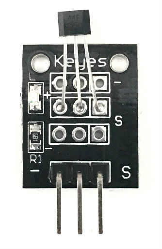

# 1. Analog Hall Magnetic Sensor

[Keyes Analog Hall Magnetic Sensor](http://www.amazon.com/analog-magnetic-sensor-KY-035-ARDUINO/dp/B0100A7J30)

## Arduino Sketches
* **[Detect Magnetic Field](Detect Magnetic Field/)** - Prints to serial when a magnetic field is detected and then again when the field disappears