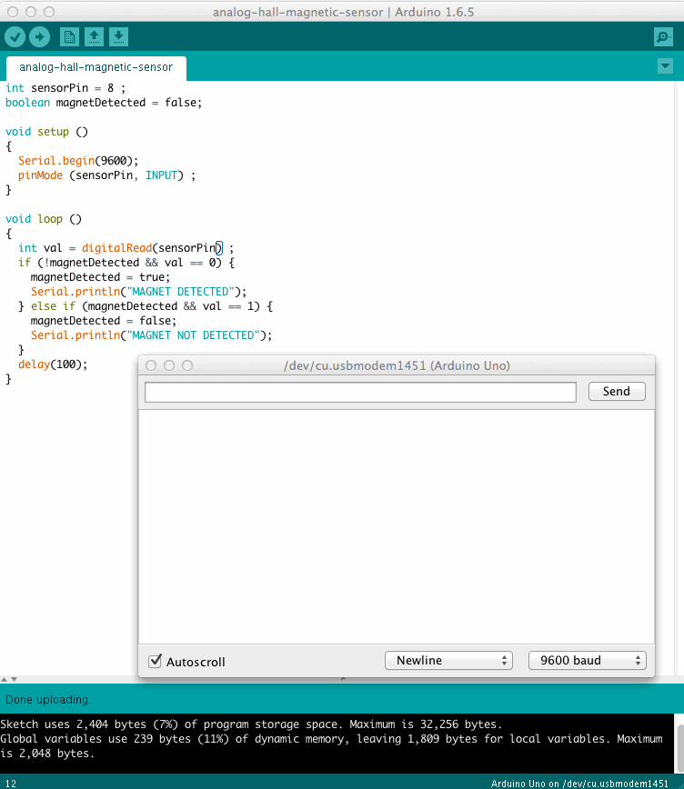
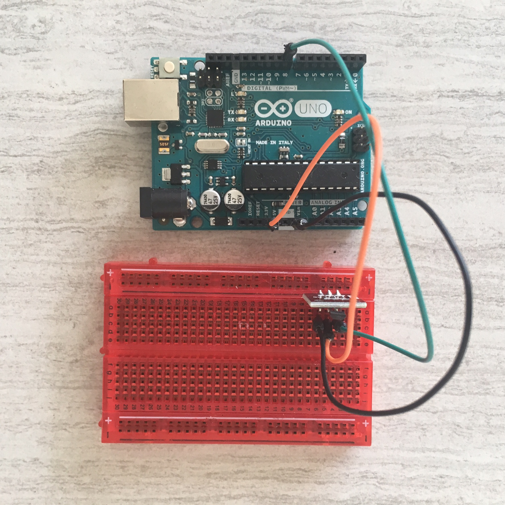
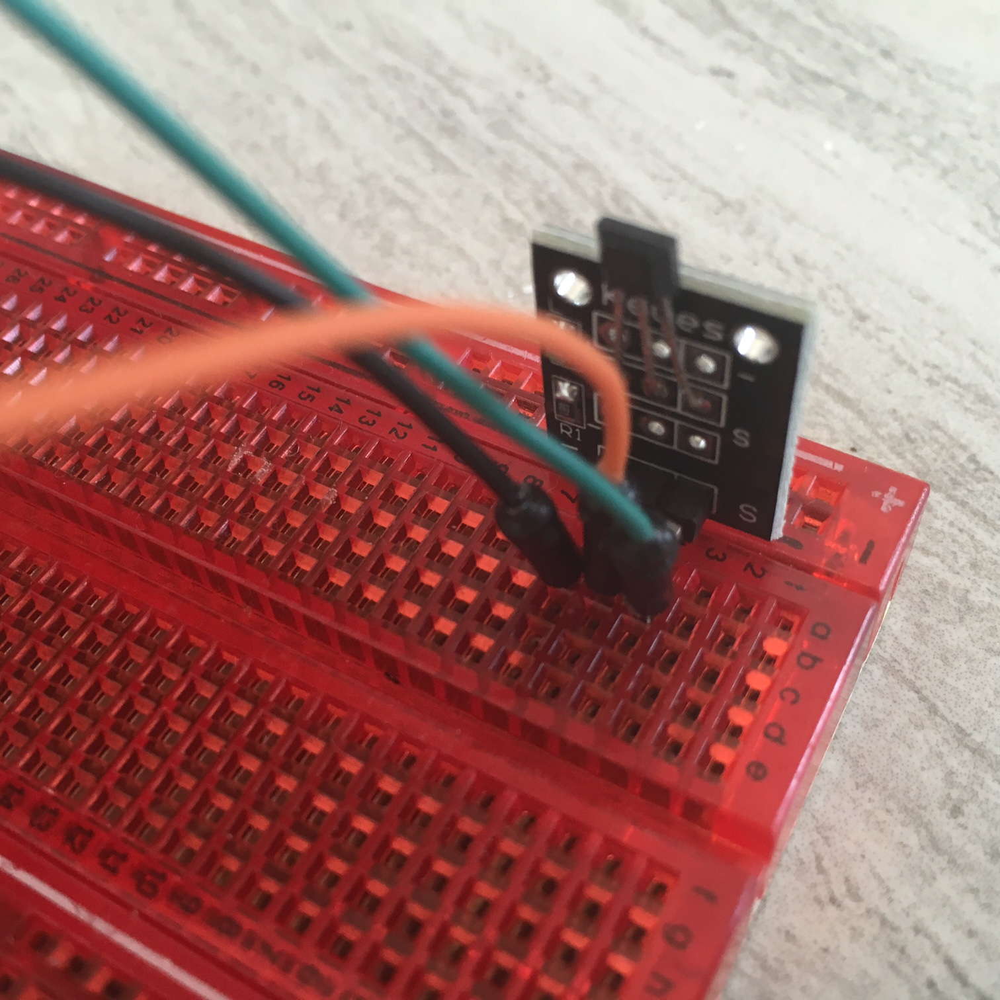
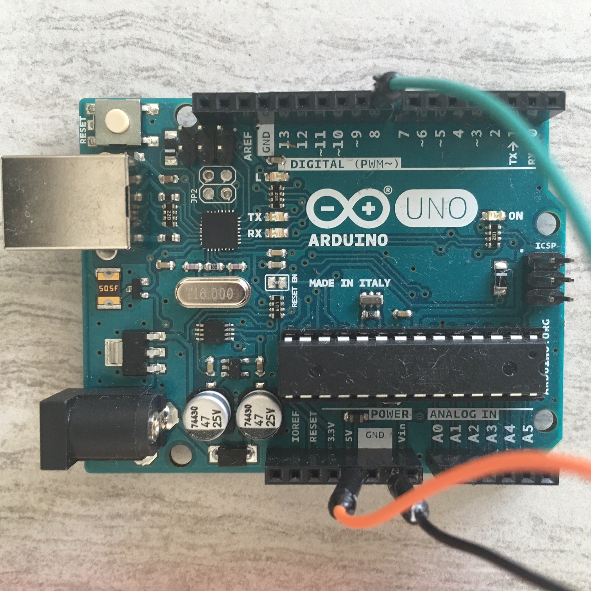

# Detect Magnetic Field
Prints to serial when a magnetic field is detected and then again when the field disappears

## Demo

## Parts Used
* 1x [Keyes Analog Hall Magnetic Sensor](http://www.amazon.com/analog-magnetic-sensor-KY-035-ARDUINO/dp/B0100A7J30)
* 1x [Ardunio UNO R3 Board Module](http://www.amazon.com/Arduino-Board-Module-ATmega328P-Blue/dp/B01A0MONA0)
* 1x [Breadboard] (http://www.amazon.com/Veewon-SYB-170-Color-Breadboard-Circuit/dp/B00OP4FQVU)
* 3x [Male-to-Male Jumper Wires](http://www.amazon.com/Phantom-YoYo-Dupont-Cable-10cm/dp/B00KOL8O6C)
* 1x [USB 2.0 Cable A-Male-to-B-Male](http://www.amazon.com/AmazonBasics-USB-2-0-Cable--Male/dp/B00NH11KIK)

## The Wiring

## The Code
See [detect-magnetic-field.ino](detect-magnetic-field.ino)