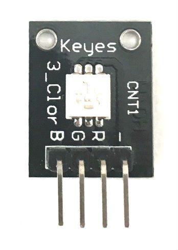

# 2. Keyes KY-009 Three-Color RGB LED

[Keyes Three-Color RGB LED on Amazon](http://www.amazon.com/DIY-3-Color-RGB-Module-Arduino/dp/B0100A92BC)

## Arduino Sketches
* **[Blink](Blink/)** - Repeatedly blinks each color (red, green, blue) in succession

## Notes
* This sensor is very similar to the [Keyes KY-016 Three-Color RGB LED](/12 - Keyes Three-Color RGB LED). See that page for more examples.