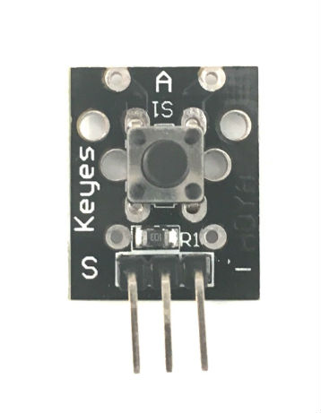

# 14. Keyes KY-004 Key Switch Sensor

[Keyes Key Switch Sensor on Amazon](http://www.amazon.com/Keyes-Key-switch-module/dp/B013GC1K98)

## Arduino Sketches
* **[Toggle LED State](Toggle LED State/)** - Toggles the state of a three-color LED each time the button is pressed