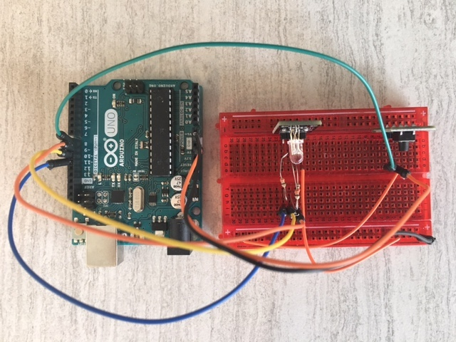
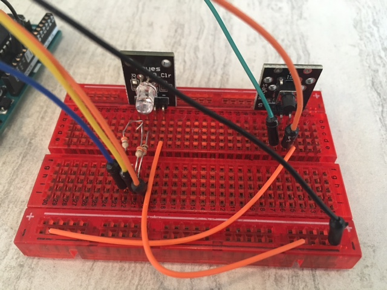
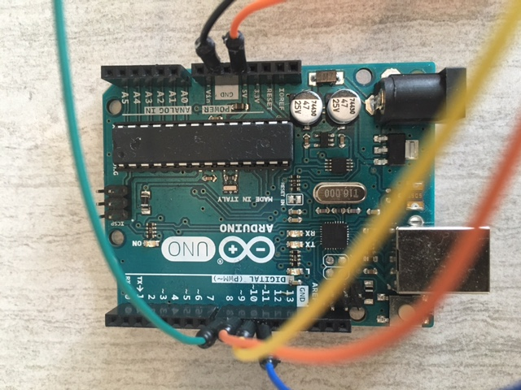

# Toggle LED State
Toggles the state of a three-color LED each time the button is pressed

## Parts Used
* 1x [Keyes Tilt Switch Sensor](http://www.amazon.com/Tilt-switch-module-for-arduino/dp/B013GBZ9MI)
* 1x [Keyes Three-Color LED](http://www.amazon.com/Keyes-Three-color-full-color-LED-plug/dp/B013GBZRSY)
* 1x [Ardunio UNO R3 Board Module](http://www.amazon.com/Arduino-Board-Module-ATmega328P-Blue/dp/B01A0MONA0)
* 1x [Breadboard] (http://www.amazon.com/Veewon-SYB-170-Color-Breadboard-Circuit/dp/B00OP4FQVU)
* 8x [Male-to-Male Jumper Wires](http://www.amazon.com/Phantom-YoYo-Dupont-Cable-10cm/dp/B00KOL8O6C)
* 3x [330 Ohm Resistors](http://www.amazon.com/E-Projects-100EP514330R-330-Resistors-Pack/dp/B0185FGN98)
* 1x [USB 2.0 Cable A-Male-to-B-Male](http://www.amazon.com/AmazonBasics-USB-2-0-Cable--Male/dp/B00NH11KIK)

## The Wiring

## The Code
See [toggle-led-state.ino](toggle-led-state.ino)