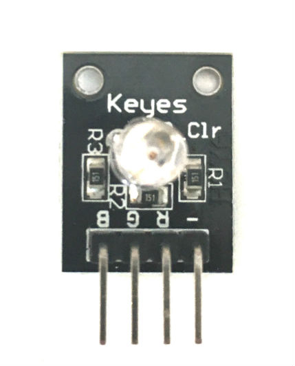

# 12. Keyes KY-016 Three-Color RGB LED

[Keyes Three-Color RGB LED on Amazon](http://www.amazon.com/Keyes-Three-color-full-color-LED-plug/dp/B013GBZRSY)

## Arduino Sketches
* **[Blink](Blink/)** - Repeatedly blinks each color (red, green, blue) in succession
* **[Toggle LED State](/11 - Keyes Key Switch Sensor/Toggle LED State/)** - Toggles the state of a three-color LED each time the button is pressed

## Notes
* This sensor is very similar to the [Keyes KY-009 Three-Color RGB LED](/02 - Keyes Three-Color RGB LED). See that page for more examples.