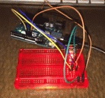

# Blink
Blink is an Arduino sketch to demonstrate the basic functionality of the Keyes RGB LED.

**Model** - Arduino Uno
**Sensor** - Keyes RGB LED

## Wiring Instructions

(Using a solderless breadboard with a labeled grid like [the one seen here](http://www.amazon.com/Solderless-Plug--BreadBoard-tie-points-200PTS/dp/B005GYATUG).)

Component  | Connection Details | 
------------- | -------------
Keyes RGB LED | Ground - a4, R - a5, G - a6, B - a7
330Ω resistor | e5 - g5
330Ω resistor | e6 - g6
330Ω resistor | e7 - g7
male jumper wire | pin 9 - h7
male jumper wire | pin 10 - h6
male jumper wire | pin 11 - h5
male jumper wire | e4 - breadboard ground
male jumper wire | breadboard ground - Arduino GND
male jumper wire | breadboard power - Arduino 5V

## Demo

