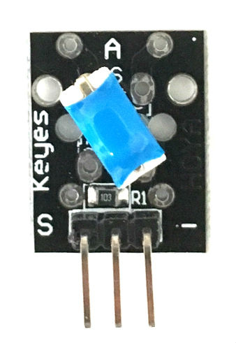

# 1. Tilt Switch Sensor

[Keyes Tilt Switch Sensor on Amazon](http://www.amazon.com/Tilt-switch-module-for-arduino/dp/B013GBZ9MI)

## Arduino Sketches
* **[Tilt Detection](Tilt Detection/)** - Demonstrates basic usage by detecting tilts