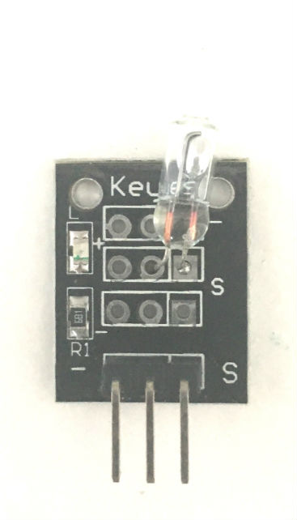

# 18. Keyes Mercury Tilt Switch Sensor

[Keyes Mercury Tilt Switch Sensor on Amazon](http://www.amazon.com/Mercury-switch-module-for-arduino/dp/B013GBZO8W)

## Arduino Sketches
* **[Tilt Detection](Tilt Detection/)** - Demonstrates basic usage by detecting tilts