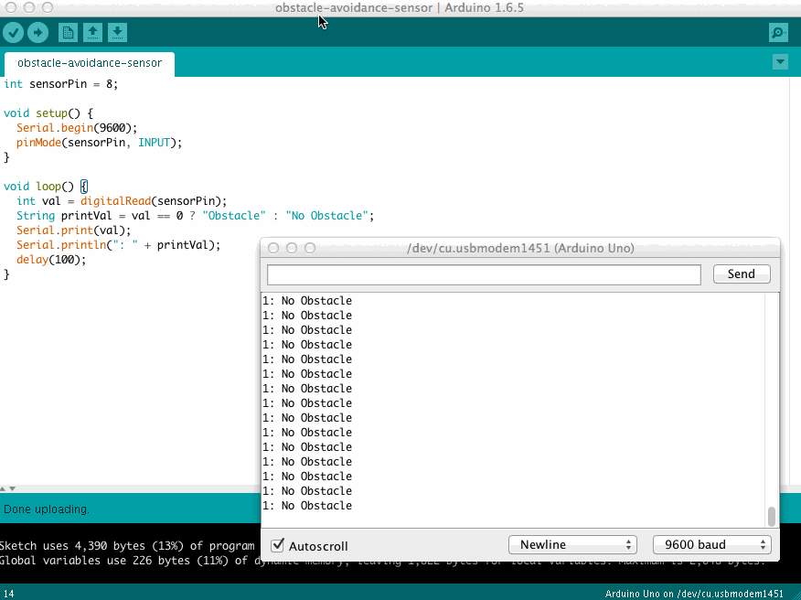
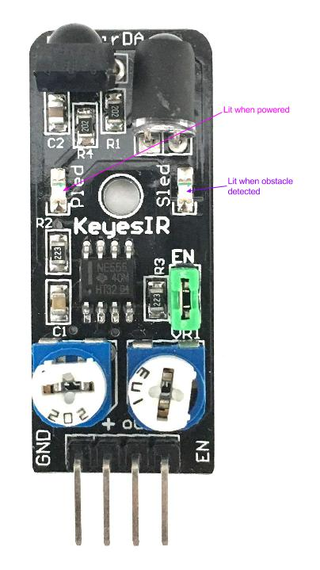
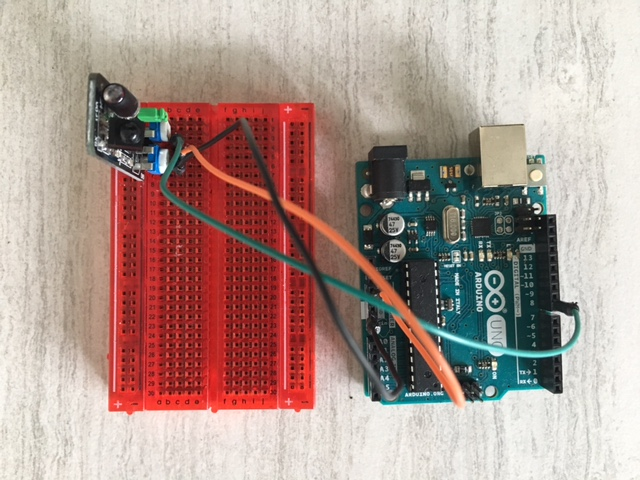
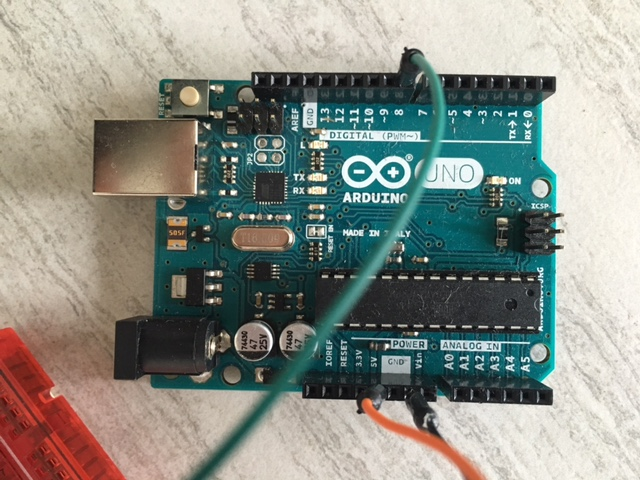
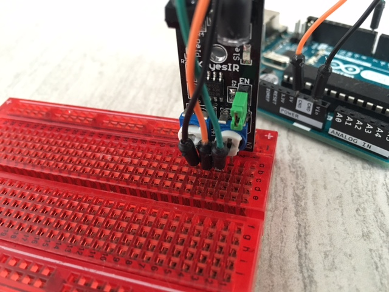

# Obstacle Detection
Demonstrates basic usage of detecting when an obstacle is and is not present

## Demo

The sensor value is 1 when an obstacle is not detected; 0 when it is.

As pictured above, one light on the sensor is lit when the module is powered. The second lights up when an obstacle is detected.

## Parts Used
* 1x [Keyes Obstacle Avoidance Sensor](http://www.amazon.com/Keyes-Obstacle-avoidance-sensor-module/dp/B013GBXZ7O)
* 1x [Ardunio UNO R3 Board Module](http://www.amazon.com/Arduino-Board-Module-ATmega328P-Blue/dp/B01A0MONA0)
* 1x [Breadboard] (http://www.amazon.com/Veewon-SYB-170-Color-Breadboard-Circuit/dp/B00OP4FQVU)
* 3x [Male-to-Male Jumper Wires](http://www.amazon.com/Phantom-YoYo-Dupont-Cable-10cm/dp/B00KOL8O6C)
* 1x [USB 2.0 Cable A-Male-to-B-Male](http://www.amazon.com/AmazonBasics-USB-2-0-Cable--Male/dp/B00NH11KIK)

## The Wiring

## The Code
See [obstacle-detection-basic-usage.ino](obstacle-detection-basic-usage.ino)