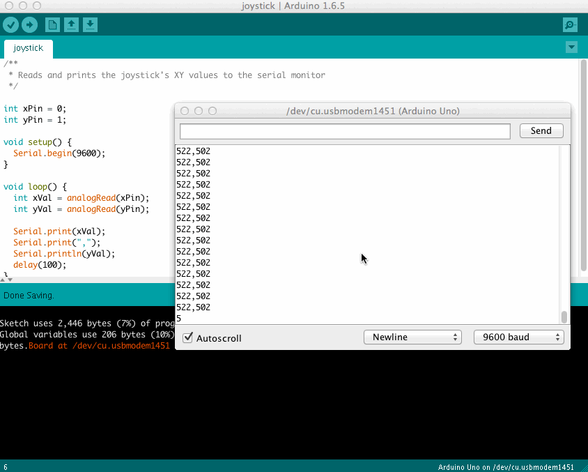

# Read Joystick XY Values
Demonstrates basic usage of the joystick sensor by reading and printing the XY values

## Demo

Note: the XY values in real life are printing much faster than the GIF captures in this demo

## The Wiring

## The Code
See [read-joystick-xy-values.ino](read-joystick-xy-values.ino)
